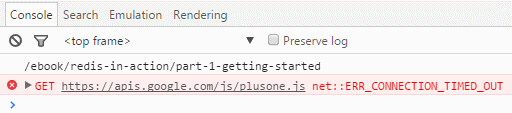

# cache-ria-ebook
cache-ria-ebook is a program written in [Go](http://golang.org) that caches the [Redis in Action ebook](https://redislabs.com/ebook/redis-in-action) hosted on [redislabs.com](https://redislabs.com/).

#### Purpose
Redis fans from China will have problems to visit [Redis in Action ebook](https://redislabs.com/ebook/redis-in-action)  because accessing Google services is blocked in China.  
This ebook uses <https://apis.google.com/js/plusone.js> and that will make loading pages very slow in China:

#### Usage
  * Get the [latest release](https://github.com/northbright/cache-ria-ebook/releases/latest).
  * Run  `./cache-ria-ebook`

It'll create a `ria-ebook` folder to hold cached pages(html files) and images.

#### Thanks
* Thanks [redislabs.com](https://redislabs.com/) that they purchased rights to distribute [Redis in Action ebook](https://redislabs.com/ebook/redis-in-action).
* Thanks [Dr. Josiah Carlson(Author of Redis in Action)](https://github.com/josiahcarlson) that wrote such a great book.

#### Paperback of Redis in Action
* 

* [Chinese Translation of Redis in Action(translator:黄健宏)](http://redisinaction.com/)

--------------------------------

# cache-ria-ebook

cache-ria-ebook 是一个[Go](http://golang.org) 语言写的程序，用于缓存[redislabs.com](https://redislabs.com/)上的[Redis in Action ebook](https://redislabs.com/ebook/redis-in-action) 。

#### 目的
中国Redis的爱好者在访问[Redis in Action ebook](https://redislabs.com/ebook/redis-in-action) 会遇到麻烦，因为Google的服务在中国是不可用的。  

这本电子书使用了<https://apis.google.com/js/plusone.js>，这会导致访问这些页面加载速度极其缓慢：

#### 使用方法
  * 获取[最新的编译好的二进制版本](https://github.com/northbright/cache-ria-ebook/releases/latest)。
  * 运行  `./cache-ria-ebook`

运行完毕后，将会创建一个`ria-ebook`的文件夹，用于存放缓存后的电子书（HTML文件）和图片。

#### 感谢
* 感谢 [redislabs.com](https://redislabs.com/) 购买授权以发布 [Redis in Action ebook](https://redislabs.com/ebook/redis-in-action)。
* 感谢 [Josiah Carlson博士(Redis in Action的作者)](https://github.com/josiahcarlson)写了这本这么棒的书。

#### Redis in Action的纸质书
* 

* [中文翻译版：《Redis实战》(翻译者：黄健宏)](http://redisinaction.com/)
